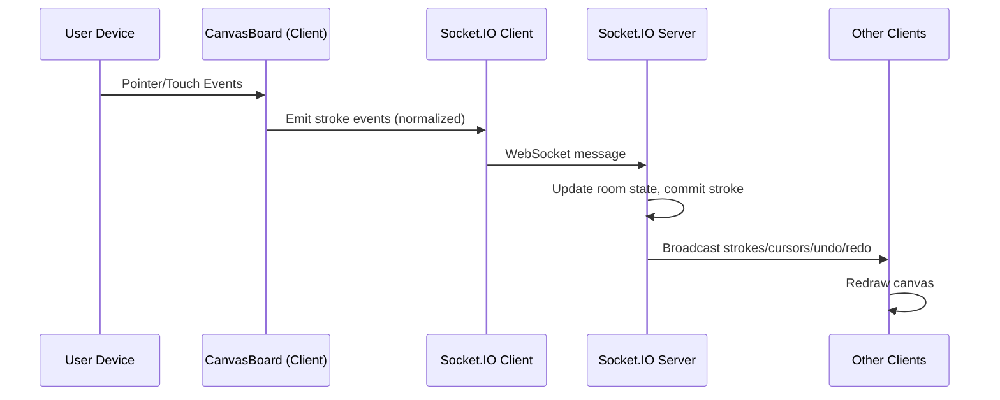

# Architecture

## System Overview
- **Frontend**: Vite/React client renders the collaborative canvas, captures pointer/touch events, and streams drawing actions via Socket.IO.
- **Backend**: Node.js + Express + Socket.IO server maintains authoritative stroke history, user presence, and room state in memory.
- **Scalability**: Data is transient (in-memory). For persistence or horizontal scaling, integrate external state management (e.g., Redis) and sticky sessions.

## Data Flow Diagram

- All points are normalized to [0,1] for device-agnostic rendering.
- Clients draw optimistically and reconcile with authoritative server state.

## WebSocket Protocol

- `join { name?, room? }` → `init { user, users, strokes }` + `user:joined` to peers
- `stroke:start { strokeId, tool, color, size }` → broadcast `stroke:start`
- `stroke:points { strokeId, points[] }` → broadcast `stroke:points`
- `stroke:end { strokeId }` → server commits, broadcast `stroke:commit { stroke }`
- `undo` / `redo` → broadcast `stroke:undo { strokeId }` / `stroke:redo { stroke }`
- `clear` → broadcast `clear`
- `cursor:move { x, y }` → broadcast `cursor { userId, name, color, x, y }`
- `ping`/`pong` for latency

## Undo/Redo Strategy

- Each room maintains an ordered stroke list and an undo stack.
- Undo removes the latest stroke and pushes it to the redo stack; redo pops from redo and re-applies.
- New strokes clear the redo stack.
- All undo/redo actions are broadcast to ensure global consistency.

## Performance Decisions

- **Normalized Coordinates**: Prevents pixel drift and simplifies replay after resize.
- **Incremental Drawing**: Only new points are sent during pointer moves; full replay occurs on commit, undo/redo, or reconnect.
- **Optimistic UI**: Clients render strokes immediately, then reconcile with server for consistency.
- **CORS & Security**: Server restricts origins and validates user/room presence.
- **Scalability**: For multi-instance deployments, use a shared adapter (e.g., Redis) to synchronize Socket.IO events.

## Conflict Resolution

- **Authoritative Server**: The server serializes all drawing events, ensuring a single source of truth.
- **Event Ordering**: Strokes and eraser actions are applied in strict order for deterministic results.
- **Simultaneous Actions**: If multiple users draw or undo simultaneously, the server’s order prevails and is broadcast to all clients.
- **Late/Missing Events**: Out-of-order or dropped cursor events do not affect canvas consistency; the next valid update corrects state.

## Performance and resilience
...existing code...
